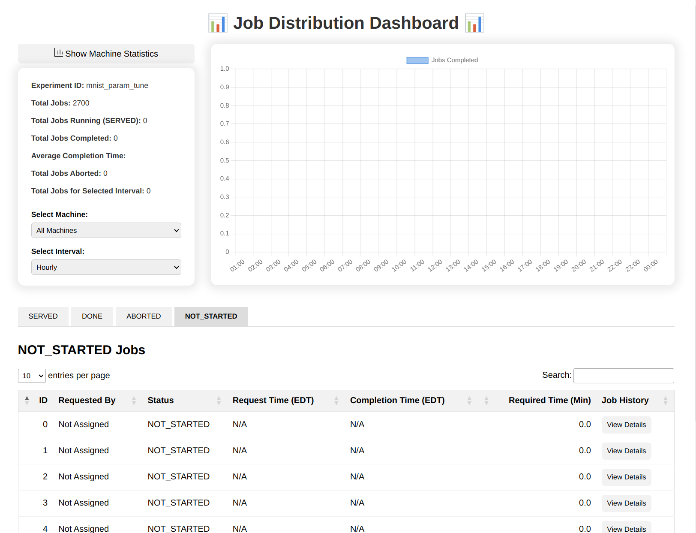

# Job Distributor

A lightweight job distribution framework designed for running thousands of parameterized simulations in parallel. Ideal for research experiments where results depend on specific parameter combinations, and the goal is to identify the most effective configuration based on an objective metric (e.g., accuracy, performance, efficiency).

## Key Features

- Easily define and generate all combinations of parameters
- Distribute jobs across multiple runners/processes
- Monitor job status through web based dashboard application
- Scalable: add more computing resources when resources are available to use

## Use Case

In many research scenarios, simulations must be run across a wide range of parameter settings to identify the optimal configuration. Doing this sequentially is slow and inefficient. `job-distributor` enables you to run these jobs in parallel across available resources—locally, on clusters, or even across machines—dramatically speeding up experimentation.