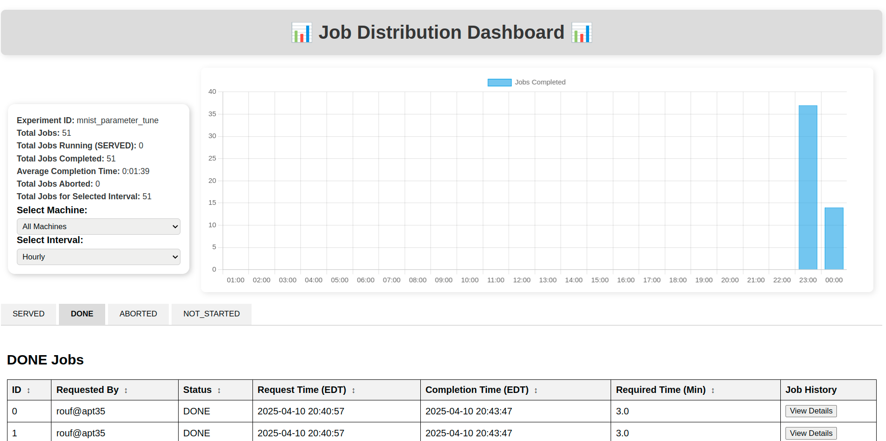

## Server Setup

## (1) Clone the Repository and Install Dependencies

To get started, clone the job-distributor repository and setup virtual environment and install dependencies to your local machine:

Terminal (Linux or macOS)
```bash
git clone https://github.com/NWSL-UCF/job-distributor.git
cd job-distributor/server
python3 -m venv venv
source venv/bin/activate
pip install -r requirements.txt
```
For powershell (windows)
```bash
git clone https://github.com/NWSL-UCF/job-distributor.git
cd job-distributor\server
python3 -m venv venv
.\venv\Scripts\Activate.ps1
pip install -r requirements.txt
```

Update `config.json` file that contains all the necessary settings. Below is an example configuration:

```json
{
    "expId": "mnist_param_tune",
    "jobDB": "jobs.csv",
    "host": "localhost",
    "dashboard_port": 5050,
    "server_port": 5000,
    "idleTimeout": 120,
    "abortedJobResetTimeout": 600,
    "fresh_start": true,
    "enable_ngork": true,
    "parameters": {
        "epochs": [1, 2, 4, 8, 16, 32],
        "optimizer": ["adam", "sgd", "lbfgs"],
        "hidden_layers": [1, 2, 4, 8, 16],
        "nodes_per_layer": [10, 20, 30, 40, 50],
        "batch_size": [4, 8, 16, 32, 64, 128]
    }
}
```

### Configuration Fields

- **`expId`**: Name of the experiment (e.g., `"mnist_param_tune"`).
- **`jobDB`**: CSV file to store job metadata. Keep as `jobs.csv`.
- **`host`**: Set to `localhost` if running locally, or use a public IP/domain for remote access.
- **`dashboard_port` / `server_port`**: Ports for web dashboard and backend API. Default: 5050 / 5000.
- **`idleTimeout`**: In seconds. Resets job to `NOT_STARTED` if client goes idle (default: 120).
- **`abortedJobResetTimeout`**: In seconds. Time before `ABORTED` jobs are retried (default: 600).
- **`fresh_start`**: If `true`, all job statuses will reset on startup. Set to `false` to resume from previous state.
- **`enable_ngork`**: Set to `true` to expose your local server using ngrok (see setup below).

---

## (2) Ngrok Setup (for Local Servers)

To allow remote worker machines to access a local job server, ngrok can be used to expose it over the internet. This is one time effort. If you've already installed it, you can skip this step.

### Step 1: Install ngrok

**Linux:**
```bash
wget https://bin.equinox.io/c/4VmDzA7iaHb/ngrok-stable-linux-amd64.zip
unzip ngrok-stable-linux-amd64.zip
sudo mv ngrok /usr/local/bin
```

**Windows:**
1. Download ngrok from: https://ngrok.com/download
2. Extract and move the binary to a convenient location (e.g., `C:\ngrok`)
3. Optionally add the path to your system `PATH` variable

### Step 2: Authenticate ngrok

After creating an account on [ngrok.com](https://ngrok.com), you'll receive an auth token.

**Run the following command:**
```bash
ngrok config add-authtoken <your_auth_token>
```

This stores your token in:
- `~/.ngrok2/ngrok.yml` (Linux/macOS)
- `%HOMEPATH%\.ngrok2\ngrok.yml` (Windows)

Once this is done, ngrok will automatically tunnel your server when `enable_ngork` is set to `true`.

---

## (3) Run the Job Server

To start the job server in the background:

### For **Linux/macOS**:
```bash
python start.py &
```
### For **Windows**:
```bash
Start-Process python -ArgumentList "start.py"
```
Then you'll be able to see this texts in the terminal or shell
```bash
>> dashboard : NgrokTunnel: "https://039b05366555.ngrok-free.app" -> "http://localhost:5050"
 * Serving Flask app 'dashboard'
 * Debug mode: off
 >> job_server : NgrokTunnel: "https://9c10a92e13eb.ngrok-free.app" -> "http://localhost:5000"
 * Serving Flask app 'server'
 * Debug mode: off
```
This output confirms that your job server and dashboard are running and publicly accessible via ngrok.

The dashboard URL (e.g., https://039b05366555.ngrok-free.app) lets you monitor job progress in real time. In your case, the URL may appear differently. Each time a local service is exposed via ngrok, it generates a unique, random URL. Therefore, when accessing the dashboard or configuring a worker machine, make sure to use the correct, currently active URL. That's why you need to see the terminal or shell after starting the job-server for ngrok generated URL. 

The job server URL (e.g., https://9c10a92e13eb.ngrok-free.app) is used by worker machines (clients) to fetch and submit jobs. You'll need this url to setup the worker-machine or client side code.

You can open the dashboard URL in any browser from any machine with internet access to view and manage job statuses.



To monitor logs in real time, use:

In Linux or macOS
```bash
tail -f mnist_param_tune/dashboard.log
tail -f mnist_param_tune/server.log
```
In windows
```bash
Get-Content mnist_param_tune\dashboard.log -Wait
Get-Content mnist_param_tune\server.log -Wait
```
N.B.: You can always find the URLs for the job-server and dashboard at the beginning of the log files.

---
## (4) Best Practices

- Ensure the server has a **stable internet connection** during the entire experiment.
- Use descriptive names for your experiments via `expId`.
- Keep `jobDB` and port settings as default unless you have a specific reason to change them.
- Use `fresh_start: false` if you want to resume an interrupted experiment.
---
